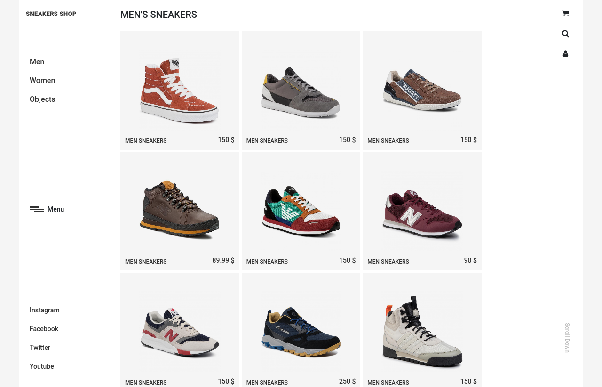

# Sneakers_Shop

## HTML CSS Capstone project

## Built With

- HTML5,
- CSS3,
- Grid,
- Bootstrap v.4,
- Javascript,
- Jquery

## Live Demo

[Live Demo Link](https://raw.githack.com/mariancristu/Sneakers_Shop/splash-screen/index.html)

## Getting Started

**Use browser of choise**

## Authors

👤 **Cristu Marian**

- Github: [@mariancristu](https://github.com/mariancristu)
- Twitter: [@marian_cristu](https://twitter.com/marian_cristu)
- Linkedin: [marian-cristu](https://www.linkedin.com/in/marian-cristu-b687b3197)

## Credit:

Layout: [https://www.behance.net/gallery/80392909/AXEL-ARIGATO-Website](https://www.behance.net/gallery/80392909/AXEL-ARIGATO-Website)

### Layout Author:

👤 **Dmitry Oxygen**

- [Dmitry Oxygen in Dribbble](https://dribbble.com/oxygen_dima)

## Show your support

Give a ⭐️ if you like this project!
